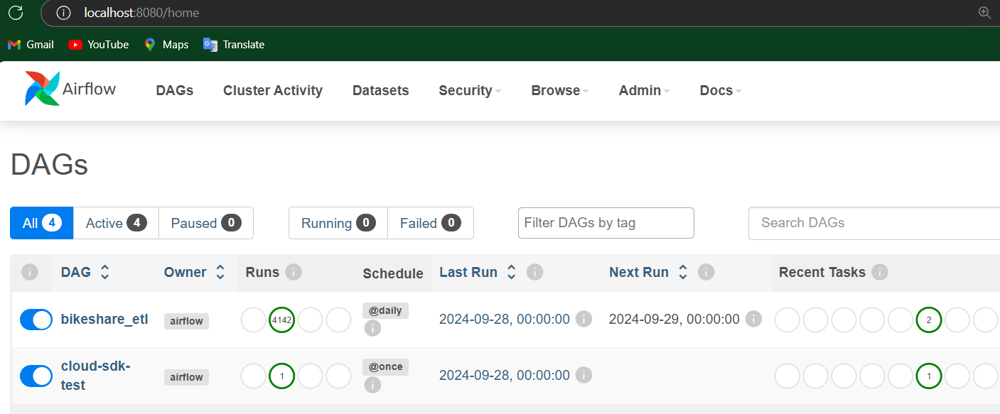
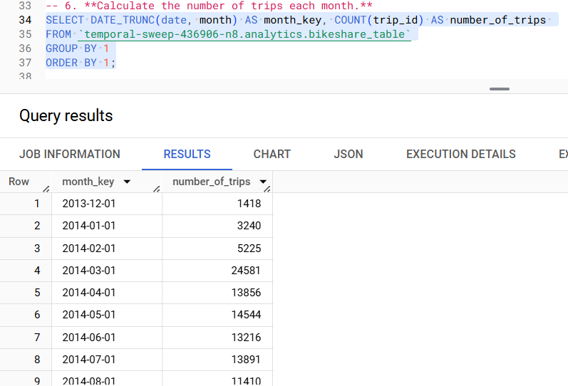
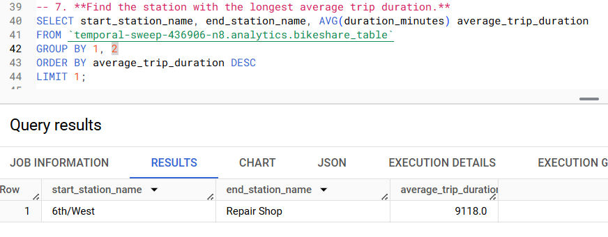
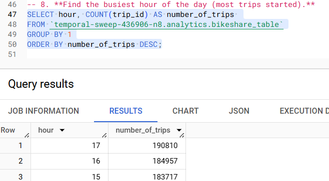

# Zeals ETL Project
[](https://github.com/ebbrylhub/zeals-hw-etl)

## Table of Content
- [Zeals ETL Project](#zeals-etl-project)
  * [How to Setup and Run the Project](#how-to-setup-and-run-the-project)
    + [1. Setup the Project](#1-setup-the-project)
      - [Build the image and container using docker-compose](#build-the-image-and-container-using-docker-compose)
    + [2. Run the Project](#2-run-the-project)
      - [Open Airflow in Browser](#open-airflow-in-browser)
      - [Login into Airflow](#login-into-airflow)
      - [Enable the DAGS](#enable-the-dags)
      - [Completed State](#completed-state)
    + [Prerequisites and Environment Information](#prerequisites-and-environment-information)
      - [Prerequisites](#prerequisites)
      - [Environment Setup](#environment-setup)
    + [Project Structure](#project-structure)
  * [Feature Checklist](#feature-checklist)
    + [Task 1: Data Extraction and Storage](#task-1-data-extraction-and-storage)
    + [Task 2: Creating BigLake Table](#task-2-creating-biglake-table)
    + [Task 3: Airflow DAG for Automation](#task-3-airflow-dag-for-automation)
    + [Task 4: Containerization](#task-4-containerization)
      - [1: Create a Dockerfile:](#1-create-a-dockerfile-)
      - [2: Docker Compose:](#2-docker-compose-)
    + [Task 5: Data Analysis](#task-5-data-analysis)
      - [1. Find the total number of trips for each day.](#1-find-the-total-number-of-trips-for-each-day)
      - [2. Calculate the average trip](#2-calculate-the-average-trip)
      - [3. Identify the top 5 stations with the highest number of trip starts.](#3-identify-the-top-5-stations-with-the-highest-number-of-trip-starts)
      - [4. Find the average number of trips per hour of the day.](#4-find-the-average-number-of-trips-per-hour-of-the-day)
      - [5. Determine the most common trip route (start station to end station).](#5-determine-the-most-common-trip-route-start-station-to-end-station)
      - [6. Calculate the number of trips each month.](#6-calculate-the-number-of-trips-each-month)
      - [7. Find the station with the longest average trip duration.](#7-find-the-station-with-the-longest-average-trip-duration)
      - [8. Find the busiest hour of the day (most trips started).](#8-find-the-busiest-hour-of-the-day--most-trips-started-)
      - [9. Identify the day with the highest number of trips.](#9-identify-the-day-with-the-highest-number-of-trips)
      - [Data Completeness](#data-completeness)
    + [Task 6: Documentation](#task-6-documentation)

## How to Setup and Run the Project

### 1. Setup the Project 
**[:arrow_up: back to top](#table-of-content)**
#### Build the image and container using docker-compose
```bash
docker-compose up -d --build
```
This will run docker-compose with build parameter in the background. Once completed you will see this:


**[:arrow_up: back to top](#table-of-content)**

### 2. Run the Project
**[:arrow_up: back to top](#table-of-content)**
#### Open Airflow in Browser
http://localhost:8080/home

#### Login into Airflow
Use admin credentials for the first login


#### Enable the DAGS
For the first setup we need to enable the DAGS so it will run a backfill for scheduled DAGS from its start_date


#### Completed State


**[:arrow_up: back to top](#table-of-content)**

### Prerequisites and Environment Information
#### Prerequisites
In order to run this project these conditions need to be met:
- Docker/Docker Desktop Installed (Docker Compose Included)
- WSL 2 Installed (For Windows User)
- GCP Service Account with BigQuery & GCS Access

Don't worry about:
- Google Cloud SDK (Will be installed in Docker)
- Python (Will be installed in Docker)

Version Used:
> Docker version 27.1.1, build 6312585

> Docker Compose version v2.28.1-desktop.1

> WSL version: 2.2.4.0

#### Environment Setup
There are 3 environment variables need to be check in the *Dockerfile*:
```bash
ENV GOOGLE_CLOUD_PROJECT=<project_id>
ENV GCS_BUCKET_NAME=<gcs-bucket-name>
ENV BQ_DATASET_NAME=<bigquery-dataset-name>
```

**Note**:
- GOOGLE_CLOUD_PROJECT for Project ID Google Cloud SDK
- GCS_BUCKET_NAME for Google Cloud Storage Bucket Destination
- BQ_DATASET_NAME for Big Query Dataset Destination

**[:arrow_up: back to top](#table-of-content)**

### Project Structure
Following the Assignment standard, these are the project structure used

    zeals-hw-etl/ (Project Folder)
    |-- dags/ (DAG Folder)
        |-- bikeshare_etl.py (DAG File)
            |-- scripts/ |-- service_account.json (GCP SA)
            |-- scripts/ |-- etl_bq_to_gcs.py (Scripts)
            |-- scripts/ |-- etl_gcs_to_bq_biglake.py (Scripts)
            |-- scripts/ |-- data_analysis.sql (Scripts)
        |-- cloud_sdk_test.py (DAG File)
    |-- docs/images/ (Documentation Images Folder)
    |-- logs/ (Log Folder)
    |-- Dockerfile (Docker for Airflow Environment)
    |-- docker-compose.yml (Docker Compose YML)
    |-- requirements.txt (Requirements for Airflow Environment)
    |-- README.md (Documentation & Instructions)

**[:arrow_up: back to top](#table-of-content)**

## Feature Checklist
**[:arrow_up: back to top](#table-of-content)**
### Task 1: Data Extraction and Storage
- Write a Python or Spark script to extract data from the
`bigquery-public-data.austin_bikeshare.bikeshare_trips` table in BigQuery 
> Python script are used to extract bikeshare trips data from Big Query
- The script should query the data for the previous day to keep the extraction
manageable and relevant for daily updates 
> The Use of Jinja kwargs['ds'] for extracting yesterday data
- The data extracted should be partitioned by date and hour to optimize
storage and query performance
> The data is partitioned by date & hour in both GCS and Big Lake External Table (BQ)
- Save the data in Parquet
> The data saved in Parquet Format
- Ensure the data is organized in a directory structure that reflects the
partitioning (e.g.,
`gs://your-bucket-name/bikeshare/YYYY-MM-DD/HH/data.parquet`)
> Implemented with `gs://bigquery-analytics-bucket/bikeshare/date=YYYY-MM-DD/hour=HH/data.parquet`

**[:arrow_up: back to top](#table-of-content)**

### Task 2: Creating BigLake Table
- Write a script or use Airflow operators to create an external table in
BigQuery
> PythonOperator in Airflow is used to create the external table in BigQuery.
- The table should reference the partitioned data stored in GCS
> GCS are references with partition of date and hour
- Ensure the external table is updated or recreated daily to reflect the new
partitions of data
> The table will be created in the first job run, and then it will be updated daily

**[:arrow_up: back to top](#table-of-content)**

### Task 3: Airflow DAG for Automation
- Develop an Airflow DAG to automate the ETL pipeline, ensuring it runs
daily
> The Airflow DAG is developed to automate the ETL pipeline scripts (`bikeshare_etl.py`)
- Schedule the DAG to run once every day
> The Airflow DAG is automated to run `@daily` by using schedule_interval

**[:arrow_up: back to top](#table-of-content)**

### Task 4: Containerization

#### 1: Create a Dockerfile:
- Write a Dockerfile to containerize the Airflow environment along with the
necessary scripts
> Dockerfile are created to containerize the Airflow Environment
- Ensure all dependencies (e.g., Google Cloud SDK, Python packages) are
installed
> Google Cloud SDK, Python & Python packages are installed within Docker
- Set environment variables as needed for authentication and configuration
> Environment variables are done in Docker for Cloud SDK authentication using Service Account 

#### 2: Docker Compose:
- Create a `docker-compose.yml` file to set up Airflow services, including the
scheduler and web server
> docker-compose are used to setup airflow services of scheduler, web server, worker, postgres db for metadata, redis for CeleryExecutor
- Ensure the services can be easily started, stopped, and managed using Docker Compose
> We can easily start & managed using `docker-compose up -d`, and stopped using `docker-compose down`

**[:arrow_up: back to top](#table-of-content)**

### Task 5: Data Analysis

#### 1. Find the total number of trips for each day.


**[:arrow_up: back to top](#table-of-content)**

#### 2. Calculate the average trip 
duration for each day.**


**[:arrow_up: back to top](#table-of-content)**

#### 3. Identify the top 5 stations with the highest number of trip starts.


**[:arrow_up: back to top](#table-of-content)**

#### 4. Find the average number of trips per hour of the day.


**[:arrow_up: back to top](#table-of-content)**

#### 5. Determine the most common trip route (start station to end station).


**[:arrow_up: back to top](#table-of-content)**

#### 6. Calculate the number of trips each month.



**[:arrow_up: back to top](#table-of-content)**

#### 7. Find the station with the longest average trip duration.



**[:arrow_up: back to top](#table-of-content)**

#### 8. Find the busiest hour of the day (most trips started).



**[:arrow_up: back to top](#table-of-content)**

#### 9. Identify the day with the highest number of trips.


**[:arrow_up: back to top](#table-of-content)**

#### Data Completeness
Data Comparison between Public Data and The Projects.


**[:arrow_up: back to top](#table-of-content)**

### Task 6: Documentation
- Provide a `README.md` file with detailed instructions on how to set up and run the project
> README contain detailed instruction on how to setup and run the projects
- Include information on prerequisites (e.g., Docker, Google Cloud SDK),
environment setup, and how to trigger the Airflow DAG
> README include the information on prerequisites and how to trigger the Airflow DAG
- Explain the project structure, including where to place configuration files
and scripts
> The project structure are explain in the documentation

**[:arrow_up: back to top](#table-of-content)**